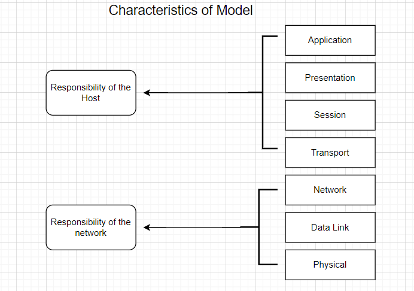
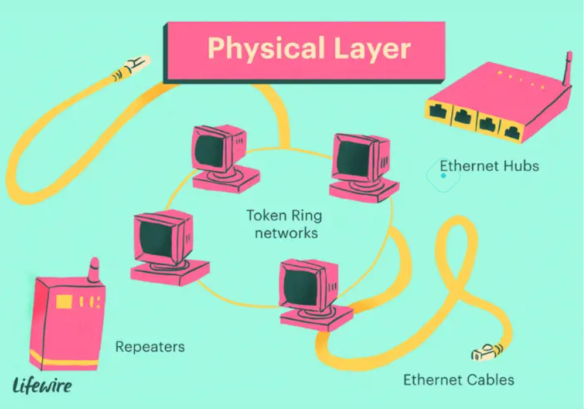
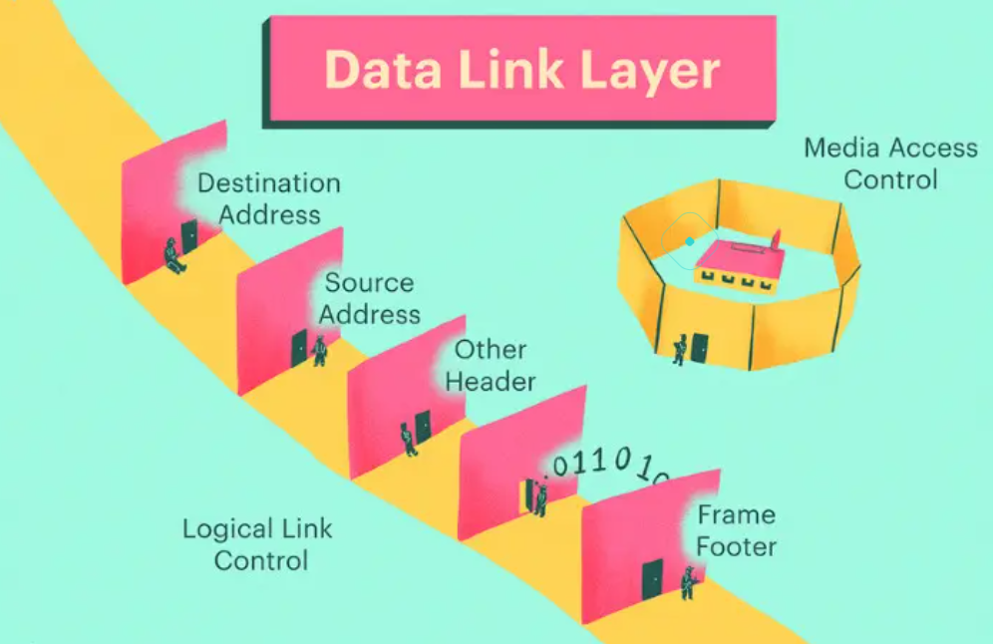
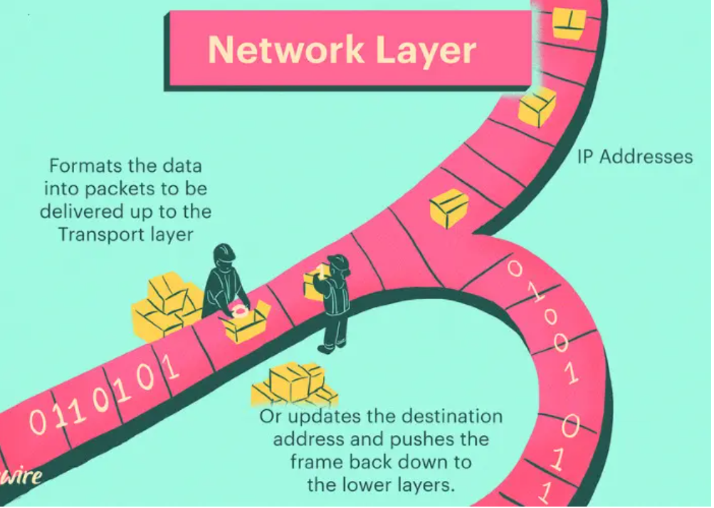
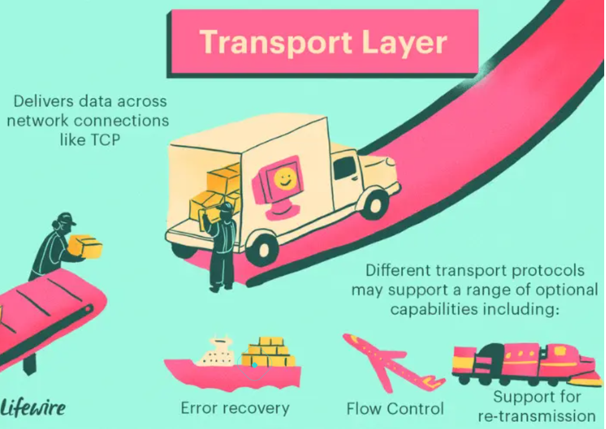
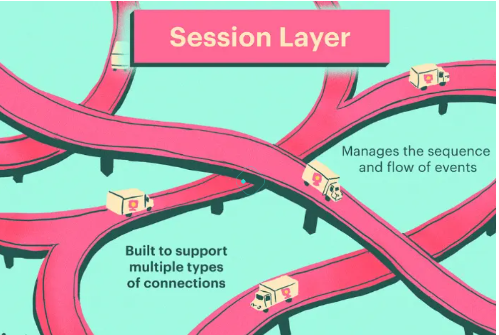
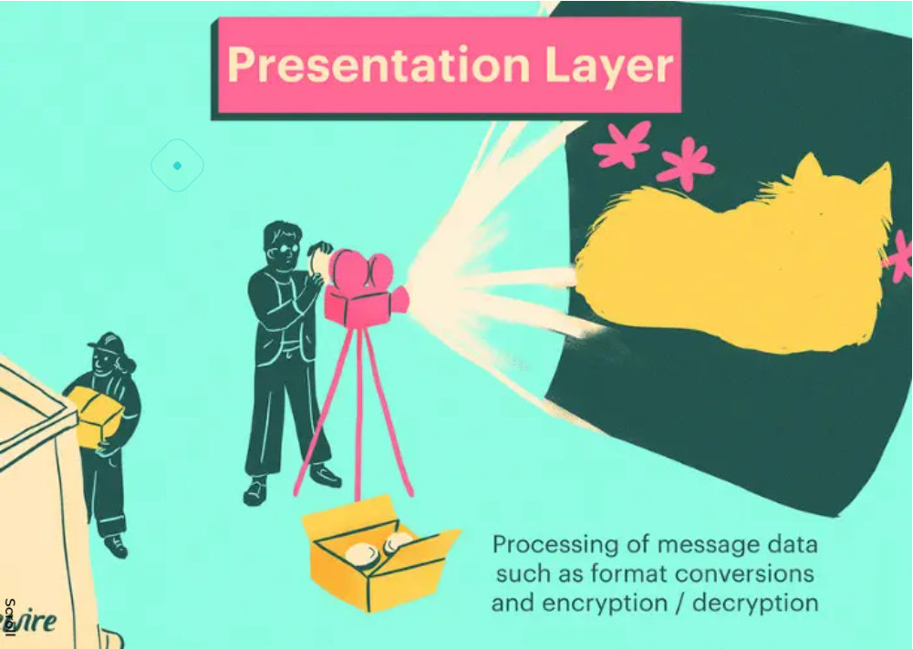

### Tầng trên (Application – Presentation – Session – Transport)
Tầng trên của **mô hình 7 tầng OSI** chủ yếu giải quyết các vấn đề liên quan đến ứng dụng và chúng chỉ được triển khai trong phần mềm. Tầng Ứng dụng gần người dùng cuối nhất. Cả người dùng cuối và tầng Ứng dụng đều tương tác với các ứng dụng phần mềm.
### Tầng dưới (Physical – Data Link – Network)
Tầng dưới của **mô hình OSI** giải quyết các vấn đề về vận chuyển dữ liệu. Lớp liên kết dữ liệu và lớp vật lý được thực hiện trong phần cứng và phần mềm.

Hai nhóm lớn của mô hình OSI.

#### Physical Layer(Tầng vật lý)
là tầng thấp nhất trong **các tầng OSI**, đảm bảo việc truyền dữ liệu qua môi trường vật lý và không quan tâm đến nội dung hay ý nghĩa của dữ liệu. Nó tạo ra một đường truyền vật lý ổn định và đáng tin cậy để các tầng cao hơn có thể gửi và nhận các gói tin dữ liệu.
Nhiệm vụ của tầng Vật lý bao gồm:
- **Truyền dữ liệu:** Tầng Vật lý biến các bit thành tín hiệu vật lý để truyền qua các phương tiện truyền thông như cáp đồng trục, cáp xoắn đôi, cáp quang hay sóng vô tuyến. Nó xác định các quy tắc về tốc độ truyền, đồng bộ hóa, kích thước khung dữ liệu, phạm vi tín hiệu và các thông số vật lý khác.
- **Điều hiển tín hiệu:** Tầng Vật lý quản lý các tín hiệu điều khiển như tín hiệu báo động, tín hiệu đồng bộ, tín hiệu kiểm tra lỗi, và tín hiệu điều chỉnh tốc độ truyền dữ liệu.
- **Định dạng dữ liệu:** Tầng Vật lý xác định cấu trúc và định dạng của dữ liệu trong từng bit, ví dụ như định dạng NRZ (Non-Return-to-Zero), Manchester, AMI (Alternate Mark Inversion) và các phương pháp khác.
- **Mã hóa và giải mã:** Tầng Vật lý thực hiện mã hóa và giải mã các tín hiệu để đảm bảo việc truyền dữ liệu chính xác.

#### Tầng Data Link Lyer(tầng liên kết dữ liệu)
Chịu trách nhiệm cho việc truyền dữ liệu an toàn qua các đường truyền vật lý và xác định địa chỉ vật lý (MAC address). Tầng Liên kết dữ liệu cung cấp các dịch vụ cho tầng mạng và có hai phân lớp con:
- **Lớp LLC(Logical Link Control):** Lớp LLC quản lý các quy tắc truyền thông đồng bộ và không đồng bộ, kiểm soát lỗi và kiểm tra tính toàn vẹn của dữ liệu. Nó đảm bảo việc truyền thông tin một cách tin cậy giữa các điểm cuối trên cùng một mạng liên kết.
- **Lớp MAC (Media Access control):**  Lớp MAC xác định cách truy cập vào phương tiện truyền thông chia sẻ, chẳng hạn như mạng LAN Ethernet. Nó quản lý việc gán địa chỉ vật lý (MAC address) cho các thiết bị mạng và xử lý việc truyền dữ liệu giữa các đầu cuối trên cùng một mạng.
Tầng Data Link layer có các chức năng quan trọng:
- **Đóng gói dữ liệu:** Tầng này chia dữ liệu từ tầng mạng thành các khung dữ liệu nhỏ hơn để truyền qua đường truyền vật lý.
- **Tầng địa chỉ vật lý:** Tầng Liên kết dữ liệu sử dụng địa chỉ MAC để xác định nguồn và đích của các khung dữ liệu.
- **Kiểm soát lỗi:** Tầng này thực hiện kiểm tra lỗi, phát hiện và xử lý các vấn đề liên quan đến sự mất mát hoặc hỏng hóc dữ liệu ở tầng Vật lý.
- **Kiểm soát truy cập vào phương tiện truyền thông:** Tầng Liên kết dữ liệu quản lý quy tắc truy cập vào môi trường chia sẻ, đảm bảo rằng các thiết bị không xung đột và có thể truyền dữ liệu một cách hiệu quả.

#### Network Layer(tầng mạng)
Là tầng thứ ba trong mô hình OSI. Tầng này có trách nhiệm quản lý việc định tuyến và chuyển tiếp dữ liệu giữa các mạng khác nhau trong hệ thống mạng. Tầng Mạng cung cấp các dịch vụ cho tầng trên là tầng Giao vận và tầng dưới là tầng Liên kết dữ liệu.
Là tầng quan trọng trong **mô hình OSI**,** vì nó đảm bảo việc định tuyến và chuyển tiếp dữ liệu giữa các mạng khác nhau. Các chức năng quan trọng của tầng Mạng bao gồm:
- **Định tuyến (Routing):** Tầng Mạng xác định đường đi tốt nhất cho việc truyền gói tin từ nguồn đến đích qua các mạng khác nhau. Nó sử dụng các thuật toán định tuyến như RIP (Routing Information Protocol) và OSPF (Open Shortest Path First) để quyết định đường đi tối ưu.
- **Chuyển tiếp(Forwarding):** Tầng Mạng thực hiện chuyển tiếp gói tin từ đầu vào đến đầu ra thông qua các thiết bị định tuyến (router). Các thiết bị định tuyến sử dụng bảng định tuyến để xác định cách chuyển tiếp gói tin đến đích.
- **Địa chỉ IP(IP Addressing):** Tầng Mạng sử dụng địa chỉ IP để định danh và định vị các thiết bị trong mạng. Địa chỉ IP là một địa chỉ duy nhất cho mỗi thiết bị mạng và nó được sử dụng để xác định nguồn và đích của gói tin.
- **Fragmentaition và Reassembly:** Tầng Mạng có khả năng phân mảnh (fragmentation) gói tin thành các phần nhỏ hơn để truyền qua các mạng có độ dài giới hạn. Ngược lại, nó cũng có khả năng ghép (reassembly) các phần nhỏ thành gói tin ban đầu khi gói tin đến đích.

#### Transport Layer(tầng giao vận)
là tầng thứ tư trong mô hình OSI, có trách nhiệm dữ liệu truyền đi là đáng tin cậy. Nó tạo điều kiện cho việc giao tiếp hiệu quả và đáng tin cậy giữa các ứng dụng, bất kể sử dụng các mạng hoặc thiết bị khác nhau.
Các chức năng quan trọng của tầng Giao vận bao gồm:
- **Điều khiển luồng(Flow Control):** quản lý việc truyền dữ liệu giữa các ứng dụng và điều chỉnh tốc độ truyền để đảm bảo rằng khong bị quá tải hoặc quá chậm so với nguồn tiêu thụ.
- **Điều khiển lỗi(Error Control):** sử dụng các cơ chế kiểm soát lỗi như checksum và ACK/NACK để đảm bảo rằng dữ liệu được truyền một cách tin cậy và không bị lỗi.
- **Đánh số gói(Segementation/Reassembly):** chia nhỏ dữ liệu từ các ứng dụng thành các đơn vị gói tin(segment) và gắn số thứ tự vào mỗi gói. Khi nhận được,tầng Transport layer ghép các đơn vị gói lại thành dữ liệu ban đầu.
- **Đa kết nối(Connection Multiplexing):** hỗ trợ việc thiết lập và duy trì các kết nối mạng đa kết nối(munti-connection), cho phép nhiều ứng dụng cùng một thiết bị mạng gửi và nhận dữ liệu đồng thời.

#### Session Layer (tầng phiên)
Là tầng thứ năm trong mô hình mạng OSI . Tầng này có trách nhiệm thiết lập, duy trì và kết thúc các phiên (sessions) giao tiếp giữa các ứng dụng trên mạng. Nó tạo ra một môi trường nhất quán cho việc thiết lập và duy trì phiên giao tiếp, đồng bộ hóa dữ liệu và chấm dứt phiên.
Các chức năng quan trọng của tầng Session Layer bao gồm:
- **Thiết lập phiên (Session establishment):** cho phép các ứng dụng thiết lập phiên giao tiếp giữa chúng trước khi truyền dữ liệu.Quá trình này bao gồm xác định và thiết lập các thông số phiên như các thông tin định danh, cấu hình và các thông tin điều khiển khác nhau.
- **Duy trì phiên (Session maintenace):** đảm bảo việc duy trì và quản lý phiên giao tiếp giữa các ứng dụng, kiểm soát việc truyền dữ liệu giữa các ứng dụng trong suốt thời gian phiên diễn ra,đồng bộ hóa dữ liệu và xử lý yêu cầu phản hồi.
- **Đồng bộ phiên (Session synchronization):** xác định các điểm đồng bộ trong quá trình truyền dữ liệu giữa các ứng dụng.Điều này đảm bảo rằng dữ liệu được truyền một cách nhất quán và đúng thứ tự giữa các nguồn và đích.
- **Chấm dứt phiên(Session termination):** cho phép các ứng dụng kết thúc phiên giao tiếp một các an toàn và đúng quy trình .Quá trình này bao gồm thông báo truyền tải thông tinhoanf thành và giải phóng tài nguyên được sử dụng trong phiên.

#### Presentation Layer(tầng trình diễn)
Là tầng thứ sáu trong mô hình OSI. Tầng này đảm nhiệm vai trò chuyển đổi và xử lý dữ liệu từ định dạng của ứng dụng thành định dạng chuẩn để truyền qua mạng và ngược lại. Nó cung cấp các dịch vụ và các cơ chế chuyển đổi, mã hóa, nén và định dạng dữ liệu để đảm bảo rằng dữ liệu được truyền và nhận một cách chính xác, an toàn và hiệu quả.
Các chức năng chính:
- **Mã hóa/ Giải mã (Encryption/Decryption)** có khả năng mã hóa dữ liệu trước khi truyền và giải mã dữ liệu khi nhận. Điều này đảm bảo tính bảo mật trong quá trình truyền dữ liệu trên mạng.
- **Nén/ Giải nén (Compression/Decompression):** có khả năng nén dữ liệu để giảm dung lượng truyền và giải nén dữ liệu khi nhận. Điều này giúp tăng tốc độ truyền dữ liệu và giảm sử dụng băng thông mạng.
- **Định dạng dữ liệu(Data Formatting):**  thực hiện việc định dạng dữ liệu từ định dạng của ứng dụng thành định dạng chuẩn để truyền qua mạng và ngược lại. Điều này đảm bảo tính tương thích giữa các ứng dụng và hệ thống khác nhau.
- **Quản lý phiên (Session Management):** có khả năng quản lý các thông tin phiên giao tiếp giữa các ứng dụng. Nó hỗ trợ việc khởi tạo, duy trì và kết thúc phiên giao tiếp, đồng bộ hóa các hoạt động truyền dữ liệu và xử lý lỗi.

#### Application  Lyer(tầng ứng dụng)
Là tầng cuối cùng và cao nhất trong mô hình OSI. Nó cung cấp giao diện giữa người dùng và mạng, cho phép người dùng truy cập vào các dịch vụ mạng và thực hiện các hoạt động liên quan đến ứng dụng.
Gồm nhiều giao thức và dịch vụ như truyền tệp, truyền thư điện tử (email), truyền dữ liệu web, truyền dữ liệu đa phương tiện và nhiều ứng dụng khác. Một số giao thức và dịch vụ phổ biến tại tầng này bao gồm:
- HTTP (Hypertext Transfer Protocol).
- FTP (File Transfer Protocol).
- SMTP (Simple Mail Transfer Protocol).
- DNS (Domain Name System).
- SNMP (Simple Network Management Protocol).
Chức năng chính:
- Xác định các đối tác truyền thông: Application xác định tính khả dụng của các đối tác truyền thông cho một ứng dụng có dữ liệu để truyền.
- Xác định tính khả dụng của tài nguyên: Application Layer xác định xem có đủ tài nguyên mạng cho giao tiếp được yêu cầu hay không.
- Đồng bộ hóa giao tiếp: tất cả giao tiếp xảy ra giữa các ứng dụng yêu cầu sự hợp tác được quản lý bởi một Application Layer.

