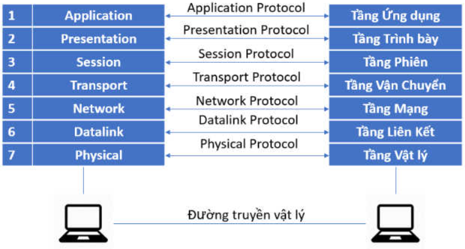
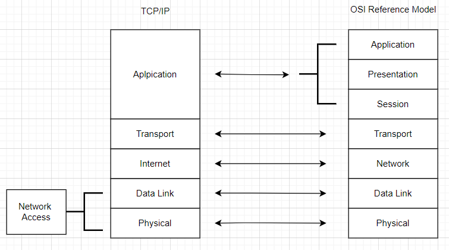
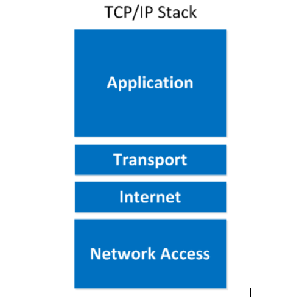

# 1. Mô hình TCP/IP và OSI
Khi một host muốn truyền dữ liệu tới một host khác, có rất nhiều công việc cần tiến hành để có thể truyền được dữ liệu. Ta chia những công việc đó thành nhiều nhóm, mỗi nhóm công việc lại gồm các công việc có tính chất tương tự nhau và mỗi nhóm công việc này gọi là 1 lớp công việc. Việc chia công việc ra thành nhiều nhóm, nhiều lớp được gọi là mô hình phân lớp.
Khi tổ chức công việc theo kiểu mô hình phân lớp ta sẽ có được những lợi ích sau:
\- Giảm thiểu độ phức tạp của các hệ thống truyền dữ liệu. Các công việc được chia ra và chuyên biệt hóa.
\- Mỗi lớp đều quy định các đặc tính kỹ thuật, các tính năng, các chuẩn bắt buộc mà các nhà sản xuất thiết bị khi tham gia sản xuất các thiết bị cho lớp ấy buộc phải tuân theo. Từ đó dẫn đến sự chuẩn hóa các giao diện của các dòng sản phẩm. 
\- Đảm bảo tính tương thích về mặt công nghệ.
\- Thúc đẩy kỹ thuật mô đen hóa.
\- Thúc đấy sự phát triển của ngành công nghệ mạng.
\- Khi chia thành các tầng, các lớp có tính chất chuyên môn hóa thì sẽ đơn giản cho việc dạy và học.

I. Mô hình OSI. (Open System Interconnection).
Đây là một mô hình phân lớp nổi tiếng được phác thảo năm 1977 bởi tổ chức ISO và được hoàn thành vào năm 1984. Mô hình này chia các lớp công việc ra thành 7 lớp:
\- Application
\- Presentation
\- Session
\- Transport
\- Network
\- Data link
\- Physical
Mỗi lớp công việc trên lại có những chức năng riêng của nó.
Chức năng của từng tầng:

So sánh mô hình TCP/IP với OSI.

1. Tầng Physical
Tầng Physical có chức năng truyền một dòng bit qua một đường truyền vật lý cụ thể nào đó. Để làm được điều đó thì lớp Physical phải định nghĩa ra các thủ tục về điện, về cơ, các thủ tục chức năng, các đặc tính kỹ thuật trong việc thiết lập, giải phóng và giải tỏa, duy trì một kết nối vật lý nào đó. (hay nói ngắn gọn thì lớp Physical xây dựng đường truyền vật lý cho các host)

2. Tầng Data link
Nhiệm vụ của tầng Data link:
\- Đóng gói dữ liệu.
\- Định địa chỉ vật lý.
\- Kiểm soát lưu lượng.
\- Kiểm soát lỗi
\-Kiểm soát truy cập.

3.Tầng Network
Tầng Network có trách nhiệm cho việc phân bố dữ liệu từ điểm này đến điểm kia một cách tối ưu nhất bằng cách thực hiện việc định tuyến các gói dữ liệu, chọn ra một đường đi tối ưu nhất để phân phối dữ liệu. 
Nhiệm vụ của tầng Network:
\- Định địa chỉ vật lý.
\- Định tuyến
4.Tầng Transport
Tầng Transport chịu trách nhiệm chuyển toàn bộ thông điệp từ nơi gửi đến nơi nhận. Tầng Transport kiểm soát độ tin cậy của một kết nối được cho trước. Tầng này có thể theo dõi các gói tin và truyền lại các gói bị thất bại.
Tầng Transport chịu trách nhiệm:
\- Xác định địa chỉ cổng.
\-  Phân mảnh và tái hợp nhất.
\- Kiểm soát kết nối.
\- Kiểm soát lưu lượng.
\- Kiểm soát lỗi
5. Tầng Session
Tầng Session đóng vai trò như một kiểm soát viên hội thoại của mạng với nhiệm vụ thiết lập, duy trì và đồng bộ hóa tính liên tác giữa 2 bên.
Tầng Session chịu trách nhiệm về:
\- Kiểm soát hội thoại.
\- Đồng bộ hóa.
\- Sau 5 lớp trên thì các ứng dụng đã có thể truyền được dữ liệu cho nhau.
6. Tầng Presentation
Các chức năng của tầng này là:
\- Đảm bảo rằng dữ liệu đc gửi có thể được đọc bởi đầu nhận.
\- Tổ chức định dạng dữ liệu.
\- Cấu trúc quá trình dữ liệu.
\- Thương lượng các cú pháp cho tầng ứng dụng.
\- Cung cấp cơ chế mã hóa.
\- Đảm bảo 2 tầng Application ở 2 đàu có thể nói chuyện đc với nhau.
7. Tầng Application 
Cung cấp các dịch vụ:
\- Thiết bị đầu cuối ảo của mạng: phần mềm đăng nhập từ xa.
\- Quản lý, truy cập và truyền vào file. 
\- Các dịch vụ khác: ứng dụng thư điện tử để trao đổi với nhau,ứng dụng ưeb
II. Phương thức hoạt động.
Mỗi tầng trong mô hình OSI, có hai phương thức hoạt động chính được áp dụng đó là: phương thức hoạt động có liên kết (connection–oriented) và không có liên kết (connectionless).

Với phương thức có liên kết, trước khi truyền dữ liệu cần thiết phải thiết lập một liên kết logic giữa các thực thể cùng lớp (layer). Còn với phương thức không có liên kết, thì không cần lập liên kết logic và mỗi đơn vị dữ liệu trước hoặc sau đó.
Phương thức có liên kết, quá trình truyền dữ liệu phải trải qua 3 giai đoạn theo thứ tự:
- Thiết lập liên kết: hai thực thể đồng mức ở hai hệ thống thương lượng vs nhau về tập các tham số sẽ đc sử dụng trong giai đoạn sau.
- Truyền dữ liệu: dữ liệu được truyền với các cơ chế kiểm soát và quản lý.
- Hủy bỏ liên kêt: giải phóng các tài nguyên hệ thống đã được cấp phát cho liên kết để dùng các liên kết khác

III. Mô hình TCP/IP (Transmission Control Protocol / Internet Protocol)
Thay vì có 7 lớp như OSI thì họ định nghĩa chỉ có 4 lớp. Người ta sử dụng các tên khác nhau từ lớp 1 đến 3 và gom lớp 5 đến lớp 7 vào trong một lớp đơn gọi là lớp Application.

So sánh mô hình TCP/IP với OSI.

1. Điểm giống nhau:
- Cả mô hình OSI và TCP/IP đều có cấu trúc các giao thức xếp chòng lên nhau theo các lớp.
- Cả hai đều được coi là mô hình logic.
- Hai mô hình phân chia các giao tiếp mạng thành các lớp rõ ràng.
- cung cấp các tiêu chuẩn giúp cho nhà sản xuất tạo ra thiết bị. Hệ thống mạng có thể hoạt động, giao tiếp vói các thiết bị, hệ thống được sản xuất từ nhà cung cấp.
2. Điểm khác nhau:
- TCP/IP chỉ sử dụng tầng ứng dụng (Application) để xác định chức năng của các tầng trên. Trong khi OSI sử dụng 3 tầng (Application, Presentation,Session).
- OSI cần sử dụng 2 tầng Physical và Data Link để xác định các chức năng của các tầng dưới cùng, TCP/IP chỉ sử dụng tầng Network để thực hiện điều đó.
- Lớp Network được mô hình OSI sử dụng để xác định các tiêu chuẩn giao thức định tuyến.Chức năng này được quản lý bởi tầng Internet trong TCP/IP.
- Mô hình TCP/IP là một tiêu chuẩn giao thức định hướng. Còn OSI là một mô hình chung dựa trên chức năng của mỗi lớp.
- Trong TCP/IP các giao thức được phát triển theo mo hình. Còn đói với mô hình OSI thì ngược lại.
- TCP/IP giúp thiết lập kết nối giữa các thiết bị sử dụng với nhau. OSI giúp chuaane hóa router,swictch,bo mạch và các phần cúng. 